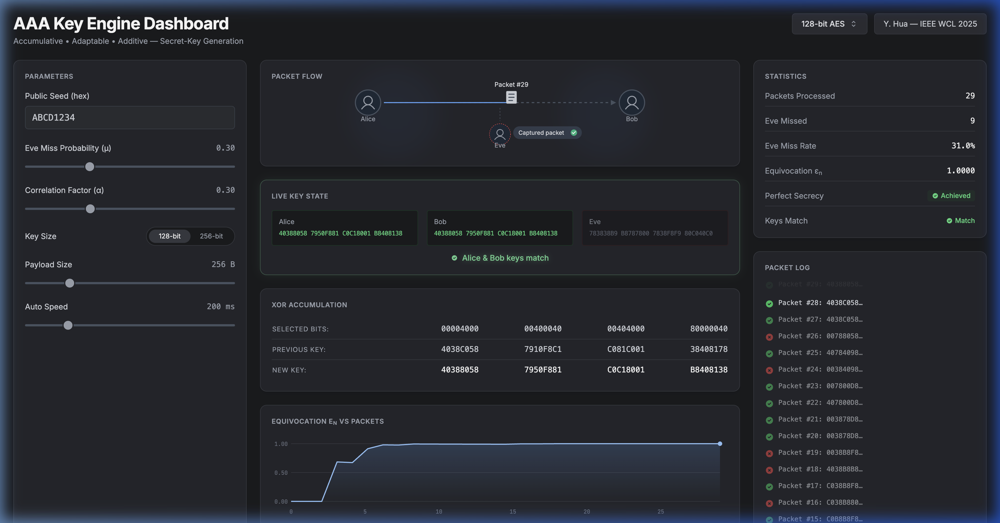

# AAA Secret-Key Generation Engine

This repository now contains four connected artifacts:

- a portable C implementation of the AAA secret-key accumulation engine,
- a browser-based dashboard that visualizes the protocol,
- a reproducible simulation and validation pipeline built around Python and `ns-3`,
- and a finished LaTeX report that assembles directly from generated CSV outputs.

The repository root is the source of truth for all generated files. The build wrappers derive paths from the checkout root and export `TMPDIR` under `tmp/system`, so temporary files, simulation outputs, report builds, and rendered pages stay on the same volume as the repository checkout.

## Current Status

- Native `ns-3` 802.11b distance sweeps are running and the generated round CSVs live under `sim/output/ns3/`.
- The Python fallback model is calibrated against the `ns-3` sweep and remains available when `ns-3` is not present.
- The final report builds cleanly to `output/pdf/aaa_secret_key_report.pdf` and is currently 9 pages.
- The hardware architecture section now includes a TikZ block diagram in addition to prose.
- The one major open item is still the Linux-hosted `ns-3` rerun. The current validated sweep was completed from this repository checkout, but not from a separate Linux machine.

## Repository Layout

```text
.
├── aaa_key_engine.c                  # Core AAA engine
├── aaa_key_engine.h                  # Public C API
├── aaa_demo.c                        # Small CLI demo
├── gui/                              # Browser visualization
├── sim/
│   ├── aaa_sweep.py                  # Python fallback + aggregation pipeline
│   ├── ns3/
│   │   ├── aaa_distance_sweep.cc     # ns-3 scratch program
│   │   └── run_ns3_sweep.sh          # ns-3 sweep wrapper
│   └── output/
│       ├── sweep_rounds.csv
│       ├── sweep_results.csv
│       ├── sweep_results_fallback.csv
│       ├── sweep_results_ns3.csv
│       ├── validation_summary.csv
│       ├── reference_run.csv
│       └── ns3/ns3_rounds_eve_*m.csv
├── report/
│   ├── main.tex
│   ├── build_report.sh
│   ├── figures/
│   │   ├── hardware_architecture.tikz
│   │   └── sweep_plot.tex
│   ├── generated/                    # TeX snippets derived from CSVs
│   └── build/                        # LaTeX build artifacts
├── output/pdf/aaa_secret_key_report.pdf
├── tmp/pdfs/                         # PNG renders of the final PDF pages
├── build_all.sh                      # End-to-end wrapper
├── ns-3.47.tar.bz2                   # Upstream ns-3 source archive
└── A_Remark_on_the_AAA_Method_for_Secret-Key_Generation_in_Mobile_Networks.pdf
```

## Quick Start

### Build the C demo

```bash
gcc -O2 -Wall -o aaa_demo aaa_demo.c aaa_key_engine.c -lm
./aaa_demo
```

### Run the fallback sweep and regenerate CSV summaries

```bash
./sim/aaa_sweep.py
```

This writes:

- `sim/output/sweep_rounds.csv`
- `sim/output/sweep_results.csv`
- `sim/output/sweep_results_fallback.csv`
- `sim/output/sweep_results_ns3.csv` when `ns-3` round files are present
- `sim/output/validation_summary.csv`
- `sim/output/reference_run.csv`
- `report/generated/metrics.tex`
- `report/generated/reference_run_rows.tex`

### Run the `ns-3` sweep

If `ns-3.47/` is already unpacked in the repository root:

```bash
./sim/ns3/run_ns3_sweep.sh
```

The wrapper copies `sim/ns3/aaa_distance_sweep.cc` into `ns-3.47/scratch/`, configures `ns-3`, and emits one round CSV per Eve distance under `sim/output/ns3/`.

Useful overrides:

```bash
DISTANCES=45 NUM_PACKETS=100 ./sim/ns3/run_ns3_sweep.sh
```

```bash
OUTPUT_DIR="$PWD/tmp/ns3_smoke" DISTANCES=45 NUM_PACKETS=5 ./sim/ns3/run_ns3_sweep.sh
```

### Build the report only

```bash
./report/build_report.sh
```

This runs `latexmk`, copies the final PDF to `output/pdf/aaa_secret_key_report.pdf`, and renders PNG page previews to `tmp/pdfs/`.

### Run the full pipeline

```bash
./build_all.sh
```

If `ns-3.47/` exists and `SKIP_NS3` is not set, the full pipeline runs the `ns-3` sweep, regenerates the CSV summaries, and rebuilds the report. If `ns-3.47/` is absent, the Python fallback and the report still build.

## Toolchain Requirements

Required:

- `gcc` or `clang` for the C demo
- Python 3 for `sim/aaa_sweep.py`
- `latexmk` plus a LaTeX distribution with `tikz`, `pgfplots`, `siunitx`, `booktabs`, and `tabularx`
- `pdftoppm` for rendered PDF page previews

Optional:

- `ns-3.47` unpacked at `./ns-3.47`

The repository includes `ns-3.47.tar.bz2`, but the unpacked `ns-3.47/` tree is treated as a local working dependency rather than a tracked source tree.

## Simulation Model

The distance sweep fixes Bob at 18 m and moves Eve from 10 m to 90 m in 5 m steps. Each distance point transmits 400 broadcast packets.

The Python fallback model uses:

- log-distance path loss,
- a logistic reception curve around the sensitivity threshold,
- shared and independent shadowing terms,
- deterministic seeding for reproducibility.

The `ns-3` model uses:

- IEEE 802.11b at `DsssRate11Mbps`,
- `YansWifiPhy`,
- `LogDistancePropagationLossModel`,
- a mild `NakagamiPropagationLossModel` stage,
- a three-node line topology with Alice, Bob, and Eve.

The shared per-round CSV schema is:

- `engine`
- `distance_m`
- `round`
- `bob_received`
- `eve_received`
- `secure_round`
- `key_secure_after_round`
- `cumulative_bob_rx`
- `cumulative_secure_rounds`
- `cumulative_equivocation`

The per-distance summary CSV schema is:

- `engine`
- `distance_m`
- `num_rounds`
- `bob_rx`
- `eve_rx`
- `secure_rounds`
- `availability`
- `secrecy_rate`
- `eve_capture_rate`
- `conditional_eve_miss`
- `first_secure_round`
- `final_equivocation`
- `bob_rx_power_dbm`
- `eve_rx_power_dbm`

## Headline Results

From the current generated artifacts:

- Reference run: Eve at 45 m, `ns-3` selected as the authoritative engine
- Availability at 45 m: 95.2%
- Secrecy rate at 45 m: 62.3%
- First secure round at 45 m: round 5
- Peak secrecy rate in the sweep: 92.8% at 90 m
- Availability at 90 m: 93.5%
- Maximum absolute fallback vs `ns-3` availability gap: 5.5 percentage points
- Maximum absolute fallback vs `ns-3` secrecy-rate gap: 6.8 percentage points

These values are generated from:

- `sim/output/sweep_results.csv`
- `sim/output/validation_summary.csv`
- `report/generated/metrics.tex`

## Report

The finished report lives at:

- `output/pdf/aaa_secret_key_report.pdf`

Current report status:

- clean LaTeX build
- 9 pages
- includes the Eve-distance sweep figure
- includes the TikZ hardware block diagram
- includes the Spring 2026 plan and references

Supporting files:

- `report/main.tex`
- `report/figures/sweep_plot.tex`
- `report/figures/hardware_architecture.tikz`
- `report/generated/metrics.tex`
- `tmp/pdfs/aaa_secret_key_report-*.png`

## Browser Demo

The browser demo is still available and remains useful for explaining the AAA mechanism visually:

- hosted demo: <https://kaushikvada3.github.io/AAA-Implementation/>
- local sources: `gui/index.html`, `gui/app.js`, `gui/engine.js`, `gui/style.css`



The dashboard shows:

- packet flow between Alice, Bob, and Eve,
- XOR-based key accumulation,
- Eve's partial observations,
- and the transition to secrecy once Bob receives a packet that Eve misses.

## Remaining Gap

The main unresolved item is the Linux-machine rerun for `ns-3`. The repository now contains a working sweep pipeline, a calibrated fallback model, generated CSV outputs, and a finished report, but the environment debt is not gone until the same sweep is rerun and locked down on an actual Linux host.

## Academic Context

This implementation and report are based on the AAA method described in:

> Y. Hua, "A Remark on the AAA Method for Secret-Key Generation in Mobile Networks," IEEE Wireless Communications Letters.

The repository also includes a local copy of the paper:

- `A_Remark_on_the_AAA_Method_for_Secret-Key_Generation_in_Mobile_Networks.pdf`

## License

This project is licensed under the MIT License. See `LICENSE`.
